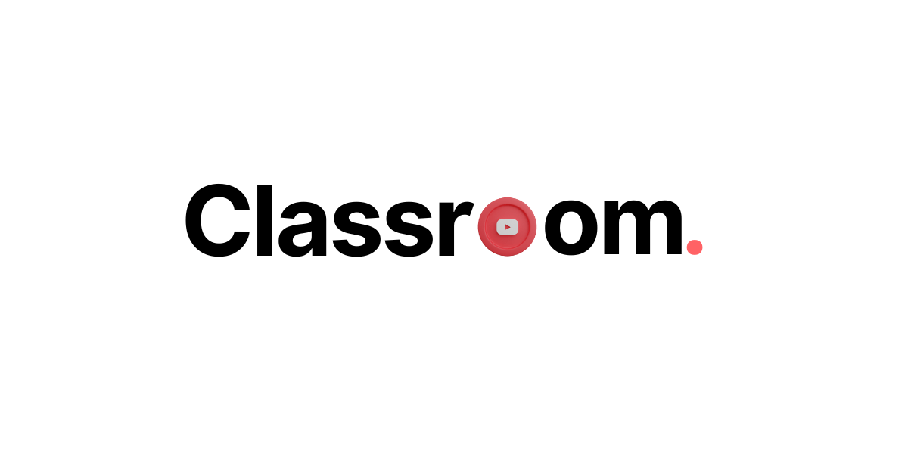

# Classroom

Learning with youtube made exciting.

## Demo

Here's a quick demo of the app.

[Classroom - Learning with YouTube made exciting](https://www.youtube.com/watch?v=uqX2yAVLC5A)


## Run Locally

Clone the project

```bash
  git clone https://github.com/GeekyChakri/Classroom.git
```

Go to the project directory

```bash
  cd Classroom
```

Install dependencies

```bash
  npm install
```

Create an .env file in root and add your variables

YouTube v3 RAPID API - [https://rapidapi.com/ytdlfree/api/youtube-v31](https://rapidapi.com/ytdlfree/api/youtube-v31)

```
  NEXT_PUBLIC_NHOST_SUBDOMAIN=
  NEXT_PUBLIC_NHOST_REGION=
  RAPID_API_KEY=
```

Start the app

```bash
  npm run dev
```

## Tech Stack

- **NextJS**

- **Typescript**

- **Tailwind**

- **Nhost**

- **Vercel**

## Author

[GeekyChakri](https://www.github.com/GeekyChakri)
